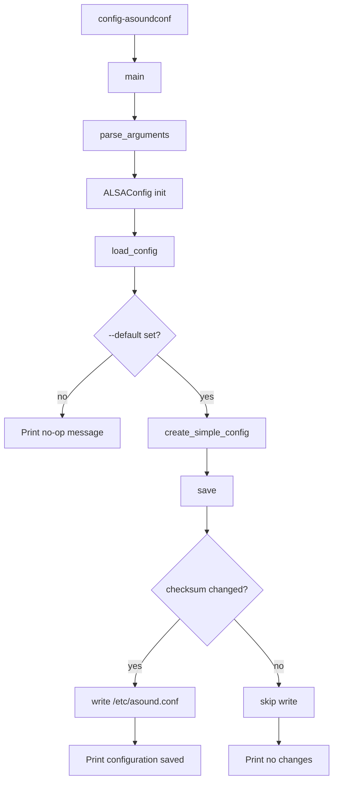

# asoundconf Command Flow

## Scope

This document describes the execution flow of [src/asoundconf.py](src/asoundconf.py), exposed by the `config-asoundconf` console command.

## Entry Point

- Console script mapping in [pyproject.toml](pyproject.toml) `[project.scripts]`:
  - `config-asoundconf -> configurator.asoundconf:main`

Typical usage:

- `config-asoundconf --default`
- `config-asoundconf --default --hw 1 --channels 2`
- `config-asoundconf` (no-op mode)

## High-Level Flow

## Detailed Function Flow

### parse_arguments

Function: [src/asoundconf.py](src/asoundconf.py)

Parses CLI flags:

- `--default` (bool): generate/write the standard ALSA config
- `--hw` (int, default `0`): ALSA card index
- `--channels` (int, default `2`): channel count

### ALSAConfig.__init__

Function: [src/asoundconf.py](src/asoundconf.py)

1. Sets target filename (default `/etc/asound.conf`).
2. Initializes in-memory content and checksum fields.
3. Calls `load_config()`.

### ALSAConfig.load_config

Function: [src/asoundconf.py](src/asoundconf.py)

1. If target file exists, reads full file into `self.config`.
2. If missing, initializes `self.config` to empty string.
3. Stores baseline MD5 checksum in `self.original_checksum`.

### ALSAConfig.create_simple_config

Function: [src/asoundconf.py](src/asoundconf.py)

Renders `SIMPLE_CONFIG_TEMPLATE` with:

- `card {hw}`
- `channels {channels}`

for both `pcm.!default` and `ctl.!default` blocks.

### ALSAConfig.save

Function: [src/asoundconf.py](src/asoundconf.py)

1. Recomputes checksum of current in-memory config.
2. Compares against original checksum captured at load time.
3. Writes file only when changed.
4. Returns:

- `True` when file was written
- `False` when unchanged

## main Decision Path

Function: [src/asoundconf.py](src/asoundconf.py)

1. Parses arguments.
2. Creates `ALSAConfig` instance.
3. If `--default`:
   - generates simple config
   - calls `save()`
   - prints either:
     - `Configuration saved.`
     - `No changes to save.`
4. If `--default` not set:
   - prints `No --default flag provided, no configuration created.`

## Side Effects

- Reads: `/etc/asound.conf` (or custom filename if class used programmatically)
- Writes: `/etc/asound.conf` only when generated content differs
- No subprocess/systemctl/DBus calls

## Notes

- The command is idempotent for identical generated config due to checksum-gated writes.
- In this repository, this flow is CLI-only; there is no direct API route in [src/server.py](src/server.py) that invokes [src/asoundconf.py](src/asoundconf.py).
