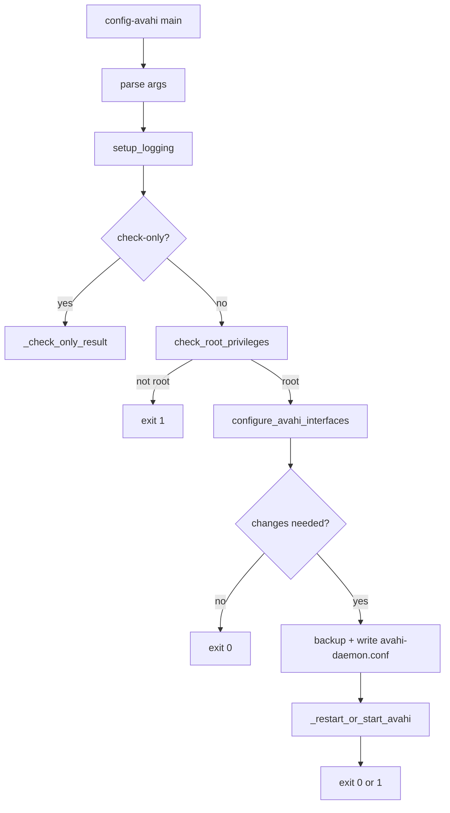

# Avahi Command Flow

## Scope

This document describes the execution flow of [src/avahi.py](src/avahi.py), exposed as the `config-avahi` CLI command.

## Entry Point

- Console script mapping in [pyproject.toml](pyproject.toml) `[project.scripts]`:
  - `config-avahi -> configurator.avahi:main`

Run examples:

- `config-avahi --check-only`
- `config-avahi`
- `config-avahi -v`

## High-Level Flow

## Detailed Function Flow

### main

Function: [src/avahi.py](src/avahi.py)

1. Parses CLI flags:
   - `--check-only`
   - `-v/--verbose`
2. Initializes logging via `setup_logging`.
3. If not `--check-only`, enforces root requirement via `check_root_privileges`.
4. Delegates to:
   - `_check_only_result` for read-only status checks
   - `configure_avahi_interfaces` for apply mode
5. Returns process-style status codes:
   - `0` success / no update needed
   - `1` failure or update required (in check mode)

### _check_only_result

Function: [src/avahi.py](src/avahi.py)

Read-only validation path:

1. If [AVAHI_CONF](src/avahi.py) does not exist, prints "Avahi daemon not installed" and returns `0`.
2. Reads `/etc/avahi/avahi-daemon.conf`.
3. Checks for exact marker line `allow-interfaces=eth0,wlan0`.
4. Returns:
   - `0` when already configured
   - `1` when configuration update is needed
   - `1` on read errors

### configure_avahi_interfaces

Function: [src/avahi.py](src/avahi.py)

Apply/update path:

1. Verifies Avahi config file exists; if not, logs skip and returns success.
2. Loads file contents.
3. Normalizes server section rules via `_filter_server_interface_rules`:
   - removes existing `allow-interfaces` and `deny-interfaces` lines in `[server]`
   - tracks whether a change is required
4. Ensures expected allow line exists via `_ensure_allow_interfaces`.
5. If no changes are required, logs and returns success.
6. If changes are required:
   - creates one-time backup `/etc/avahi/avahi-daemon.conf.backup` (if missing)
   - writes updated config
   - calls `_restart_or_start_avahi`
7. Returns `False` only when update/apply fails with actionable error.

### _restart_or_start_avahi

Function: [src/avahi.py](src/avahi.py)

Service reconciliation path using `systemctl`:

1. `systemctl is-active avahi-daemon`
2. If active:
   - `systemctl restart avahi-daemon`
   - returns failure on non-zero restart result
3. If inactive:
   - `systemctl start avahi-daemon`
   - non-zero start logs warning, but function still returns success because config write already succeeded
4. Catches subprocess/OS errors, logs warning, returns success (configuration remains applied)

## File and Service Side Effects

- Reads: `/etc/avahi/avahi-daemon.conf`
- Writes: `/etc/avahi/avahi-daemon.conf`
- Backup: `/etc/avahi/avahi-daemon.conf.backup` (first-write only)
- Service calls:
  - `systemctl is-active avahi-daemon`
  - `systemctl restart avahi-daemon`
  - `systemctl start avahi-daemon`

## Operational Notes

- The tool is intentionally idempotent: repeated runs with same target config produce no writes.
- `--check-only` is safe for non-root status verification.
- Apply mode requires root and can modify system config and service state.
