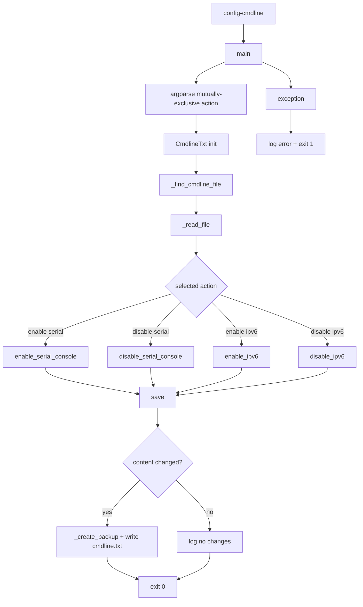

# cmdline Command Flow

## Scope

This document describes the execution flow of [src/cmdline.py](src/cmdline.py), exposed as the `config-cmdline` CLI command.

## Entry Point

- Console script mapping in [pyproject.toml](pyproject.toml) `[project.scripts]`:
  - `config-cmdline -> configurator.cmdline:main`

Run examples:

- `config-cmdline --enable-serial-console`
- `config-cmdline --disable-serial-console`
- `config-cmdline --enable-ipv6`
- `config-cmdline --disable-ipv6`

## High-Level Flow

## Detailed Function Flow

### main

Function: [src/cmdline.py](src/cmdline.py)

1. Configures INFO logging.
2. Parses exactly one action flag using a required mutually exclusive group:
   - `--enable-serial-console`
   - `--disable-serial-console`
   - `--enable-ipv6`
   - `--disable-ipv6`
3. Instantiates `CmdlineTxt`.
4. Applies the selected token mutation method.
5. Calls `save()` to persist only when content changed.
6. On exception, logs error and exits with status `1`.

### CmdlineTxt.__init__

Function: [src/cmdline.py](src/cmdline.py)

1. Resolves target file via `_find_cmdline_file()`.
2. Reads current kernel cmdline via `_read_file()`.
3. Stores baseline content in `original_content` for change detection.

### _find_cmdline_file

Function: [src/cmdline.py](src/cmdline.py)

Search order:

1. `/boot/firmware/cmdline.txt`
2. `/boot/cmdline.txt`

Raises `FileNotFoundError` if neither exists.

### Token mutation methods

Function family in [src/cmdline.py](src/cmdline.py)

- `enable_serial_console`:
  - ensures `console=serial0,115200` exists at the beginning of the token list.
- `disable_serial_console`:
  - removes `console=serial0,115200` token if present.
- `enable_ipv6`:
  - removes `ipv6.disable=1` token if present.
- `disable_ipv6`:
  - appends `ipv6.disable=1` token if missing.

All methods are idempotent and only update in-memory content when a real change is needed.

### save and backup behavior

Function: [src/cmdline.py](src/cmdline.py)

1. Compares `content` with `original_content`.
2. If changed:
   - creates backup at `<cmdline_path>.backup`
   - writes updated single-line content with trailing newline
3. If unchanged:
   - logs that no changes were made.

## File Side Effects

- Reads:
  - `/boot/firmware/cmdline.txt` or `/boot/cmdline.txt`
- Backup writes:
  - `/boot/firmware/cmdline.txt.backup` or `/boot/cmdline.txt.backup`
- Writes:
  - selected cmdline file, only if content changed
- No subprocess/systemctl/DBus calls

## Operational Notes

- The command is idempotent for repeated runs with the same target state.
- Changes affect kernel boot parameters and require reboot to take effect.
- Exactly one action is required per run due to argparse mutual exclusion.
