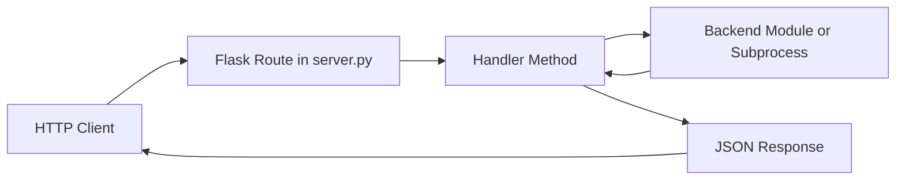

# Command and Server Flow

## Purpose

This document explains how requests and commands move through the configurator stack:

1. HTTP API route
2. Handler method
3. Backend command execution (systemctl, subprocess, DBus, helper modules)
4. Response payload

It is intended as an architecture map for debugging and onboarding.

## Entry Points

### Service startup

- `config-server` starts the Flask/Waitress API service (entrypoint in pyproject scripts).
- `ConfigAPIServer` in src/server.py creates all handlers during initialization.

### CLI commands

Console scripts are registered in pyproject scripts and map to module `main()` functions, for example:

- `config-server` -> configurator.server:main
- `config-ble-provision` -> configurator.ble_provisioning:main
- `config-sambamount` -> configurator.sambamount:main
- `config-avahi` -> configurator.avahi:main

## Core Routing Flow

In src/server.py, `_register_routes()` maps each endpoint to a handler method. The server itself mostly does routing and uniform JSON error responses; command side effects happen in handlers and backend modules.

## Quick Source Map

| Endpoint/Command Group | Route/Entry File | Primary Handler/Backend Files |
| --- | --- | --- |
| API route registration | src/server.py | src/handlers/__init__.py |
| systemd endpoints | src/server.py | src/handlers/systemd_handler.py, src/systemd_service.py |
| script execution endpoints | src/server.py | src/handlers/script_handler.py |
| reboot/shutdown endpoints | src/server.py | src/handlers/system_handler.py |
| SMB endpoints | src/server.py | src/handlers/smb_handler.py, src/sambaclient.py, src/sambamount.py |
| Bluetooth endpoints | src/server.py | src/handlers/bluetooth_handler.py, src/bluetooth.py |
| BLE provisioning endpoints | src/server.py | src/handlers/ble_handler.py |
| BLE runtime service | systemd/ble-provisioning.service | src/ble_provisioning.py, pyproject scripts |
| ALSA/asound command | pyproject scripts (`config-asoundconf`) | src/asoundconf.py |
| HAT EEPROM info command | pyproject scripts (`config-hattools`) | src/hattools.py, src/systeminfo.py |
| Hostname backend module | src/handlers/hostname_handler.py | src/hostconfig.py, src/hostname_utils.py |
| Hostname utilities module | src/handlers/hostname_handler.py, src/systeminfo.py | src/hostname_utils.py, src/hostconfig.py |
| I2C device scan backend | src/handlers/i2c_handler.py | src/i2c.py |
| Network configuration command/api | pyproject scripts (`config-network`), src/handlers/network_handler.py | src/network.py, src/cmdline.py |
| config.txt command | pyproject scripts (`config-configtxt`) | src/configtxt.py |
| cmdline kernel params command | pyproject scripts (`config-cmdline`) | src/cmdline.py |
| DSP toolkit utility | src/configurator/dsptoolkit.py | src/configurator/soundcard_detector.py |
| config key/settings endpoints | src/server.py | src/configdb.py, src/settings_manager.py |

## High-Impact Command Flows

### 1. systemd operations

Route family:

- `/api/v1/systemd/services`
- `/api/v1/systemd/service/<service>`
- `/api/v1/systemd/service/<service>/<operation>`

Execution path:

- server.py -> `SystemdHandler`
- `SystemdHandler` delegates to `SystemdServiceManager` in src/systemd_service.py
- `SystemdServiceManager` executes `systemctl` commands (system or user context)

Notes:

- Permission level is read from config (`all` vs `status`).
- Unknown services return 404 before command execution.

### 2. arbitrary configured scripts

Route family:

- `/api/v1/scripts`
- `/api/v1/scripts/<script_id>`
- `/api/v1/scripts/<script_id>/execute`

Execution path:

- server.py -> `ScriptHandler`
- `ScriptHandler` loads script definitions from `/etc/configserver/configserver.json`
- validates path + executable bit
- executes via `subprocess.run`
  - synchronous mode with timeout
  - background mode via thread

Notes:

- This is the most direct route for launching external commands from API.
- Command arguments come from preconfigured script definitions.

### 3. reboot/shutdown system commands

Routes:

- `/api/v1/system/reboot`
- `/api/v1/system/shutdown`

Execution path:

- server.py -> `SystemHandler`
- Handler validates optional delay
- Starts background thread
- Thread runs:
  - `/usr/sbin/reboot`
  - `/usr/sbin/shutdown now`

### 4. SMB mount orchestration

Route family:

- `/api/v1/smb/*`

Execution path (mount-all is the key command path):

- server.py -> `SMBHandler.handle_mount_all_samba`
- optional unmount stale mounts (`umount`)
- restart `sambamount.service` via `systemctl restart`
- trigger MPD reconcile via `systemctl start hifiberry-mpd-reconcile.service`

Notes:

- Maintains temporary mount state in `/tmp/sambamount_state.json`.

### 5. BLE provisioning service control

Routes:

- `/api/v1/ble/provisioning/status`
- `/api/v1/ble/provisioning/start`
- `/api/v1/ble/provisioning/stop`

Execution path:

- server.py -> `BLEProvisioningHandler`
- status uses `systemctl is-active ble-provisioning`
- start/stop use `systemctl start|stop ble-provisioning`
- start/stop also manage runtime override + daemon-reload

Related runtime:

- systemd unit `systemd/ble-provisioning.service` calls:
  - `config-ble-provision --check-network` (ExecStartPre)
  - `config-ble-provision --serve` (ExecStart)

### 6. ALSA asound.conf CLI flow

Entry point:

- `config-asoundconf` -> `configurator.asoundconf:main` (pyproject scripts)

Execution path:

1. CLI parses args in `parse_arguments()` from src/asoundconf.py:
  - `--default`
  - `--hw` (default `0`)
  - `--channels` (default `2`)
2. `main()` creates `ALSAConfig` targeting `/etc/asound.conf` by default.
3. `ALSAConfig.load_config()` reads existing file content (or initializes empty config).
4. If `--default` is set:
  - `create_simple_config(hw, channels)` renders `SIMPLE_CONFIG_TEMPLATE`.
  - `save()` compares MD5 checksums and writes only if content changed.
5. CLI prints one of:
  - `Configuration saved.`
  - `No changes to save.`
  - `No --default flag provided, no configuration created.`

Notes:

- This flow is currently CLI-only; there is no direct `/api/v1/*` route mapped to src/asoundconf.py in src/server.py.
- Primary side effect is writing `/etc/asound.conf` when generated content differs from the existing file.

### 7. cmdline kernel parameter CLI flow

Entry point:

- `config-cmdline` -> `configurator.cmdline:main` (pyproject scripts)

Execution path:

1. CLI parses one required mutually exclusive flag:
  - `--enable-serial-console`
  - `--disable-serial-console`
  - `--enable-ipv6`
  - `--disable-ipv6`
2. `CmdlineTxt` locates cmdline file in this order:
  - `/boot/firmware/cmdline.txt`
  - `/boot/cmdline.txt`
3. Current single-line kernel args are loaded into memory.
4. Selected operation mutates token list:
  - serial console token `console=serial0,115200`
  - IPv6 token `ipv6.disable=1`
5. `save()` writes only when content changed:
  - creates `<cmdline>.backup`
  - writes updated line with trailing newline

Notes:

- This flow is CLI-only; there is no direct `/api/v1/*` route mapped to src/cmdline.py in src/server.py.
- Side effects are file edits under `/boot*`; no subprocess/systemctl calls are used.

### 8. config.txt CLI flow

Entry point:

- `config-configtxt` -> `configurator.configtxt:main` (pyproject scripts)

Execution path:

1. CLI parses flags for overlay, autodetection, interface toggles, detection state, and profile shortcuts.
2. `ConfigTxt` loads `/boot/firmware/config.txt` into memory and computes baseline checksum.
3. Selected operations mutate in-memory lines:
  - overlay operations (`--overlay`, `--autodetect-overlay`, `--remove-hifiberry`)
  - audio/interface toggles (onboard sound, HDMI, EEPROM, I2C, SPI, HAT I2C)
  - detection toggles (`--enable-detection`, `--disable-detection`)
  - profile ops (`--default-config`, `--enable-updi`)
4. `save()` compares checksums and only writes when content changed:
  - creates `<config.txt>.backup`
  - writes updated file
5. With `--report-change`, command returns `1` when changes were made, else `0`.

Notes:

- This flow is CLI-only; there is no direct `/api/v1/*` route mapped to src/configtxt.py in src/server.py.
- Side effects are file edits under `/boot/firmware`; no subprocess/systemctl/DBus calls are used in this module.

### 9. DSP toolkit flow

Entry point:

- module API in `src/configurator/dsptoolkit.py`
- CLI `main()` in `src/configurator/dsptoolkit.py`
- generated command `config-dsptoolkit` -> `configurator.dsptoolkit:main` (from `pyproject.toml`)

Execution path:

1. `DSPToolkit` builds `base_url` from host/port (default `localhost:13141`).
2. `detect_dsp()` performs `GET /hardware/dsp` with timeout.
3. Success path requires HTTP 200 + valid JSON payload.
4. Helper methods map raw payload into:
  - detected DSP name
  - boolean detected/not-detected
  - status string (`detected`, `not_detected`, `error`, `unavailable`)

Integration note:

- `src/soundcard_detector.py` consumes `detect_dsp(timeout=2.0)` during hardware detection flows.

Notes:

- This module has no direct `/api/v1/*` route in `src/server.py`.
- Side effects are HTTP reads only; no local file writes or subprocess calls.

### 10. HAT EEPROM info flow

Entry point:

- `config-hattools` -> `configurator.hattools:main` (pyproject scripts)

Execution path:

1. CLI parses `--all` and `--verbose` flags.
2. `get_hat_info(verbose=...)` reads HAT data via `hateeprom.HatEEPROM` when available.
3. Read results are normalized:
  - `Unknown` values map to `None`.
  - failures/unavailable module return all `None` fields.
4. `main()` maps missing values to defaults:
  - `no vendor`, `no product`, `unknown`
5. Output format:
  - default: `vendor:product`
  - with `--all`: `vendor:product:uuid`

Integration note:

- `get_hat_info()` is consumed by `src/systeminfo.py`, `src/soundcard.py`, and `src/soundcard_detector.py`.

Notes:

- This module has no direct `/api/v1/*` route in `src/server.py`.
- Side effects are EEPROM reads only; no subprocess/systemctl/DBus calls.

### 11. Hostname backend flow

Entry points:

- API route `/api/v1/hostname` handled by `HostnameHandler` in `src/handlers/hostname_handler.py`
- Backend write operation in `src/hostconfig.py` via `set_hostname_with_hosts_update()`

Execution path:

1. `HostnameHandler` validates request body and optional fields (`hostname`, `pretty_hostname`).
2. If only `pretty_hostname` is provided, `hostname_utils.sanitize_hostname()` derives a system hostname.
3. `hostname_utils.validate_hostname()` validates hostname format.
4. Hostname write calls `hostconfig.set_hostname_with_hosts_update(hostname)`.
5. `set_hostname_with_hosts_update()` runs:
  - `hostnamectl set-hostname <hostname>`
  - best-effort `/etc/hosts` reconciliation through `update_hosts_file(old, new)`
6. Handler optionally sets pretty hostname through `hostname_utils.set_pretty_hostname()`.

Notes:

- This flow uses `/api/v1/hostname` route, but the hostconfig module itself is backend logic, not a direct route handler.
- Side effects include `hostnamectl` subprocess calls and `/etc/hosts` updates with backup creation.

### 12. Hostname utilities flow

Entry points:

- `src/handlers/hostname_handler.py` for API `/api/v1/hostname` operations
- `src/systeminfo.py` for hostname reporting in system info payloads

Execution path:

1. `get_hostnames()` runs:
  - `hostnamectl hostname`
  - `hostnamectl --pretty`
2. Empty pretty hostname is normalized to `None`.
3. `get_hostnames_with_fallback()` maps missing pretty hostname to hostname.
4. API write path uses utility wrappers:
  - `sanitize_hostname()` -> hostconfig sanitization logic
  - `validate_hostname()` -> hostconfig validation logic
  - `set_pretty_hostname()` -> `hostnamectl set-hostname --pretty`

Notes:

- This module centralizes read/validate/sanitize helpers and delegates system-hostname writes to hostconfig.
- Side effects are subprocess calls only; no direct `/etc/hosts` file writes in this module.

### 13. I2C device scan flow

Entry point:

- API route `/api/v1/i2c/devices` handled by `I2CHandler` in `src/handlers/i2c_handler.py`

Execution path:

1. Handler reads optional `bus` query parameter and validates range.
2. Handler calls `i2c.get_i2c_info(bus_number)`.
3. `get_i2c_info()`:
  - checks `/dev/i2c-<bus>` exists
  - checks `smbus2` import availability
  - runs `scan_i2c_bus(bus_number)` when prerequisites are met
4. `scan_i2c_bus()` probes addresses `0x03..0x77` via `smbus2.SMBus(...).read_byte`.
5. Module also reads `/sys/bus/i2c/devices/i2c-<bus>` to report kernel-managed addresses.
6. Handler returns:
  - HTTP 200 with `status=success` when module result has no `error`.
  - HTTP 200 with `status=error` when module returns an `error` field.
  - HTTP 500 with `status=error` when unexpected exceptions occur in handler flow.

Notes:

- This is an API-backed module path (no dedicated `config-*` console script).
- Side effects are hardware probe reads and sysfs reads only; no file writes/systemctl/DBus calls in `src/i2c.py`.

### 14. Network configuration flow

Entry points:

- CLI `config-network` -> `configurator.network:main` in `pyproject.toml` `[project.scripts]`
- API route `/api/v1/network` -> `NetworkHandler.handle_get_network_config()`

Execution path:

1. CLI parses one command from mutually exclusive flags (`--list-interfaces`, `--set-dhcp`, `--set-fixed`, `--enable-ipv6`, `--disable-ipv6`).
2. Interface listing path uses `list_physical_interfaces()` with filtering heuristics from `is_physical_interface()`.
3. DHCP/static paths use NetworkManager via `nmcli`:
  - discover active connection for interface
  - modify or create profile
  - reactivate connection
4. IPv6 paths combine:
  - cmdline token updates via `CmdlineTxt`
  - sysctl file writes/removals in `/etc/sysctl.d/`
  - `sysctl -p` apply
  - `nmcli` per-connection IPv6 method updates
  - `systemctl restart NetworkManager`
5. API read path calls `get_network_config()` and returns hostname, gateway, DNS servers, and physical interface details.

Notes:

- This module supports both read-only API usage and mutating CLI operations.
- Mutation paths involve subprocess/system config side effects and generally require elevated privileges.

## Bluetooth API and DBus path

Routes:

- `/api/v1/bluetooth/settings`
- `/api/v1/bluetooth/paired-devices`
- `/api/v1/bluetooth/unpair`
- `/api/v1/bluetooth/passkey`
- `/api/v1/bluetooth/modal`

Execution path:

- server.py -> `BluetoothHandler` -> src/bluetooth.py
- `get_paired_devices` and `unpair_device` use DBus (`dbus_fast`) against BlueZ (`org.bluez`)

Important behavior note:

- In the current code, `get_paired_devices()` and `unpair_device()` are async in src/bluetooth.py, while `BluetoothHandler` calls them synchronously. This should be reviewed if runtime behavior is inconsistent.

## Configuration DB Flow

Route family:

- `/api/v1/key/*`
- `/api/v1/settings/*`
- `/api/v1/setup/*`

Execution path:

- server.py delegates to `ConfigDB` and `SettingsManager`
- mostly local DB/config mutations; no external command execution required for basic key operations

## Error and Response Pattern

- Handler methods typically return `{status, message, data}` JSON.
- Command failures are usually mapped to HTTP 4xx/5xx with stderr/error strings.
- Server-level error handlers in server.py provide fallback JSON for 400/404/500.

## Related docs

- docs/api-documentation.md
- docs/asoundconf-command-flow.md
- docs/avahi-command-flow.md
- docs/bluetooth-command-server-flow.md
- docs/config-parser-flow.md
- docs/cmdline-command-flow.md
- docs/configtxt-command-flow.md
- docs/dsptoolkit-command-flow.md
- docs/hattools-command-flow.md
- docs/hostconfig-command-flow.md
- docs/hostname-utils-flow.md
- docs/i2c-flow.md
- docs/network-command-flow.md
