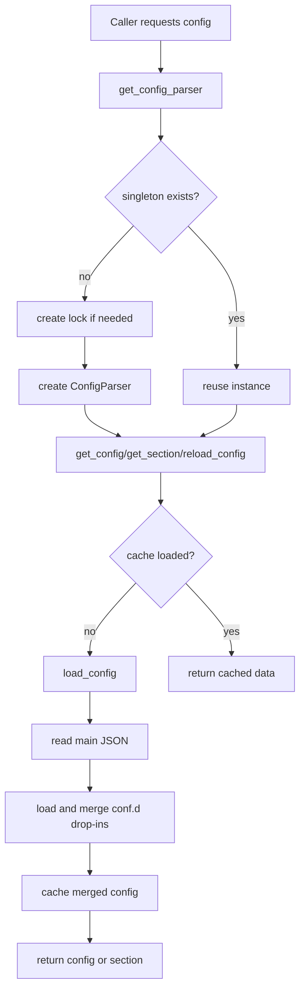

# config_parser Flow

## Scope

This document describes the execution flow of [src/config_parser.py](src/config_parser.py), which loads the main configurator JSON file and merges optional drop-in snippets.

## Role in the System

`config_parser` is a shared backend utility module (not a console script and not an HTTP route by itself). It provides:

- lazy singleton access to configuration
- section-level reads with defaults
- deterministic drop-in merge behavior

Current direct usage in handlers includes [src/handlers/systemd_handler.py](src/handlers/systemd_handler.py), which reads the `systemd` section to enforce service-operation permissions.

## High-Level Flow

## Configuration Sources

Primary constants in [src/config_parser.py](src/config_parser.py):

- `CONFIG_FILE`: `/etc/configserver/configserver.json`
- `CONFIG_DROP_IN_DIR`: `/etc/configserver/conf.d`

Runtime behavior derives the drop-in path from the configured main file directory:

- `<dirname(config_file)>/conf.d/*.json`

This allows tests or custom deployments to override `config_file` and keep drop-ins colocated.

## Detailed Function Flow

### ConfigParser.__init__

Function: [src/config_parser.py](src/config_parser.py)

1. Stores selected `config_file` (defaulting to `CONFIG_FILE`).
2. Initializes in-memory cache `self._config` as `None`.

### ConfigParser.load_config

Function: [src/config_parser.py](src/config_parser.py)

1. Verifies main file exists.
2. Loads main JSON object from disk.
3. Calls `_load_drop_ins` to merge snippets from `conf.d`.
4. Stores merged result in `self._config`.
5. Returns merged dictionary.

Error behavior:

- On missing main file, invalid JSON, or OS read errors, logs and returns `{}`.

### ConfigParser._load_drop_ins

Function: [src/config_parser.py](src/config_parser.py)

1. Computes `conf.d` path next to the main config file.
2. Globs `*.json` files and processes them in sorted order.
3. For each snippet:
   - parses JSON
   - requires top-level object/dict
   - deep-merges into current config via `_deep_merge`
4. Invalid snippets are skipped with warnings; processing continues.

### ConfigParser._deep_merge

Function: [src/config_parser.py](src/config_parser.py)

Recursive merge rules:

- `dict` + `dict`: merge by key recursively
- all other types (list, scalar, bool, null): override base value entirely

Because drop-ins are processed in lexicographic order, later filenames win for overlapping non-dict values.

### Read API

Functions: [src/config_parser.py](src/config_parser.py)

- `get_config()`: returns cached merged config, loading on first access
- `get_section(section, default)`: returns section dict or provided default
- `has_section(section)`: checks section existence
- `reload_config()`: clears cache and re-reads main + drop-ins

## Singleton and Thread-Safety

Module-level accessors in [src/config_parser.py](src/config_parser.py):

- `get_config_parser()`
- `get_config()`
- `get_config_section()`
- `reload_config()`

`get_config_parser()` uses lazy lock creation plus double-check initialization to create one shared `ConfigParser` instance safely across threads.

## Side Effects

- Reads:
  - `/etc/configserver/configserver.json`
  - `/etc/configserver/conf.d/*.json` (or equivalent paths relative to overridden main file)
- Writes:
  - none
- External commands / DBus / systemctl:
  - none

## Operational Notes

- Merge order is deterministic due to sorted globbing.
- Drop-ins must be JSON objects at top level to be merged.
- `reload_config()` is the explicit refresh point after runtime config file changes.
