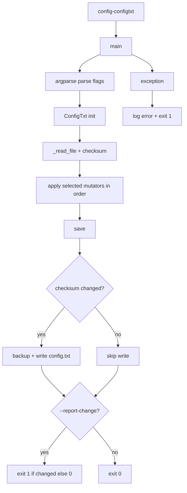

# configtxt Command Flow

## Scope

This document describes the execution flow of [src/configtxt.py](src/configtxt.py), exposed as the `config-configtxt` CLI command.

## Entry Point

- Console script mapping in [pyproject.toml](pyproject.toml) `[project.scripts]`:
  - `config-configtxt -> configurator.configtxt:main`

Common usage examples:

- `config-configtxt --default-config`
- `config-configtxt --overlay hifiberry-dac`
- `config-configtxt --autodetect-overlay`
- `config-configtxt --remove-hifiberry --enable-detection`
- `config-configtxt --disable-hdmi-sound --report-change`

## High-Level Flow

## File Handling and Change Detection

### ConfigTxt.__init__ and _read_file

Functions: [src/configtxt.py](src/configtxt.py)

1. Uses `/boot/firmware/config.txt` by default.
2. Reads full file into `self.lines`.
3. Computes `self.original_checksum` via SHA256.
4. Raises `FileNotFoundError` if the file does not exist.

### save

Function: [src/configtxt.py](src/configtxt.py)

1. Recomputes checksum from current `self.lines`.
2. If changed:
   - creates backup at `<config_path>.backup`
   - writes updated lines
   - sets `changes_made = True`
3. If unchanged:
   - leaves file untouched
   - sets `changes_made = False`

## Mutation Operations

All operations mutate `self.lines` in memory before `save()` decides whether to write.

### Overlay and detection operations

Functions in [src/configtxt.py](src/configtxt.py):

- `enable_overlay(overlay, card_name=None, disable_eeprom=False)`
- `remove_hifiberry_overlays()`
- `enable_detection()`
- `disable_detection()`
- `autodetect_overlay()`

Important behavior:

- `autodetect_overlay()` first honors detection-disabled comment.
- It removes existing HiFiBerry overlays before applying a detected one.
- It resolves overlay names through `SOUND_CARD_DEFINITIONS` from [src/soundcard.py](src/soundcard.py).
- If no card is detected, fallback overlay is `hifiberry-dac`.

### Audio and interface toggles

Functions in [src/configtxt.py](src/configtxt.py):

- onboard sound: `enable_onboard_sound()`, `disable_onboard_sound()`
- HDMI sound: `enable_hdmi_sound()`, `disable_hdmi_sound()`
- EEPROM: `enable_eeprom()`, `disable_eeprom()`
- I2C: `enable_i2c()`, `disable_i2c()`
- SPI: `enable_spi()`, `disable_spi()`
- HAT I2C overlay: `enable_hat_i2c()`, `disable_hat_i2c()`
- UPDI profile: `enable_updi()`
- profile shortcut: `default_config()`

Implementation helpers:

- `_update_line(prefix, new_line)` for key/value-style settings
- `_update_hdmi_sound(mode)` for `dtoverlay=vc4-kms-v3d` `,noaudio` toggling
- `_update_interface(interface, enable)` for dtparam on/off lines

## CLI Flag Flow (main)

Function: [src/configtxt.py](src/configtxt.py)

1. Parses independent boolean flags and optional `--overlay` value.
2. Instantiates `ConfigTxt`.
3. Applies enabled operations in a fixed order.
4. Calls `save()` exactly once after all mutations.
5. Exit codes:
   - default success: `0`
   - error: `1`
   - with `--report-change`: returns `1` when changes were made, else `0`

## Side Effects

- Reads: `/boot/firmware/config.txt`
- Backup writes: `/boot/firmware/config.txt.backup`
- Writes: `/boot/firmware/config.txt` when content changed
- No subprocess/systemctl/DBus calls in this module

## Operational Notes

- The command is idempotent for repeated runs with identical resulting state.
- Multiple flags can be combined in one invocation, and all selected mutations are applied before save.
- `--report-change` inverts typical success semantics for automation: changed state maps to non-zero exit code.
