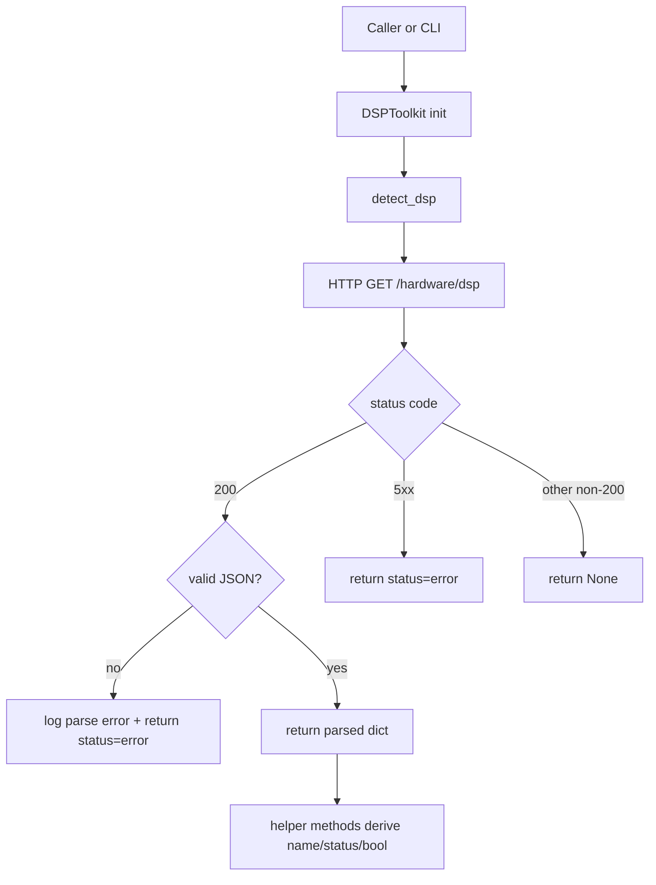

# dsptoolkit Flow

## Scope

This document describes the execution flow of [src/configurator/dsptoolkit.py](src/configurator/dsptoolkit.py), which provides DSP detection helpers and a small CLI around the local DSP service.

## Entry Points

- Programmatic API:
  - `DSPToolkit` class methods
  - module-level convenience functions (`detect_dsp`, `get_detected_dsp_name`, `is_dsp_detected`)
- CLI mode:
  - `main()` in [src/configurator/dsptoolkit.py](src/configurator/dsptoolkit.py)
  - generated command `config-dsptoolkit` -> `configurator.dsptoolkit:main`
  - can also be run as `python -m configurator.dsptoolkit`

The command is generated from `[project.scripts]` in [pyproject.toml](pyproject.toml).

## Service Contract

Default target service:

- Host: `localhost`
- Port: `13141`
- Endpoint: `/hardware/dsp`

Expected successful payload shape:

```json
{
  "detected_dsp": "ADAU14xx",
  "status": "detected"
}
```

## High-Level Flow



## Core Function Flow

### DSPToolkit.__init__

Function: [src/configurator/dsptoolkit.py](src/configurator/dsptoolkit.py)

1. Stores host, port, timeout.
2. Builds `base_url` as `http://{host}:{port}`.

### DSPToolkit.detect_dsp

Function: [src/configurator/dsptoolkit.py](src/configurator/dsptoolkit.py)

1. Calls `GET {base_url}/hardware/dsp` with configured timeout.
2. If HTTP 200:
  - parses JSON and returns normalized dict on success
  - returns `{"status": "error"}` on JSON parse failure
  - returns `{"status": "error"}` when payload is not a JSON object
3. For HTTP 5xx response, returns `{"status": "error"}`.
4. For other non-200 responses, returns `None`.
5. For connection, timeout, or request exceptions, logs and returns `None`.

Status normalization:

- runtime status is normalized to one of:
  - `detected`
  - `not_detected`
  - `error`
  - `unavailable`
- unknown, missing, or non-string status values normalize to `error`

### DSPToolkit.get_detected_dsp_name

Function: [src/configurator/dsptoolkit.py](src/configurator/dsptoolkit.py)

1. Calls `detect_dsp()`.
2. Returns `detected_dsp` only when `status == "detected"` and value is a string.
3. Otherwise returns `None`.

### DSPToolkit.is_dsp_detected

Function: [src/configurator/dsptoolkit.py](src/configurator/dsptoolkit.py)

1. Calls `detect_dsp()`.
2. Returns `True` only when response exists and `status == "detected"`.

### DSPToolkit.get_dsp_status

Function: [src/configurator/dsptoolkit.py](src/configurator/dsptoolkit.py)

1. Calls `detect_dsp()`.
2. Returns:
  - `"unavailable"` when response is `None`
  - normalized `status` when response is present

## Convenience Function Flow

Functions: [src/configurator/dsptoolkit.py](src/configurator/dsptoolkit.py)

- `detect_dsp(...)`
- `get_detected_dsp_name(...)`
- `is_dsp_detected(...)`

Each convenience function creates a fresh `DSPToolkit` instance and delegates to one class method call.

## CLI Flow

Function: [src/configurator/dsptoolkit.py](src/configurator/dsptoolkit.py)

Supported output modes:

- `--name-only`
- `--status-only`
- `--json`
- default human-readable mode

Selection flow:

1. Parse host/port/timeout and output mode flags.
2. Configure logging (`DEBUG` with `-v`, else `WARNING`).
3. Instantiate `DSPToolkit`.
4. Execute first matching mode branch (`name-only`, else `status-only`, else `json`, else default).

Exit behavior:

- Returns `0` only when status is `detected`.
- Returns `1` for unavailable/not detected/error states.

## Integration Points

Primary in-repo consumer:

- [src/configurator/soundcard_detector.py](src/configurator/soundcard_detector.py)

Observed usage pattern:

- Calls `detect_dsp(timeout=2.0)` during sound card detection passes.
- Uses returned DSP info as an input signal for card identification/refinement.

## Side Effects

- Network I/O:
  - HTTP GET to `http://<host>:<port>/hardware/dsp`
- File I/O:
  - none
- Subprocess/systemctl/DBus:
  - none

## Operational Notes

- The module is defensive: transport failures degrade to `None`/`unavailable`, while bad service responses (invalid JSON, 5xx, non-object payload) degrade to `{"status": "error"}`.
- Convenience functions are simple wrappers and do not share client state across calls.
