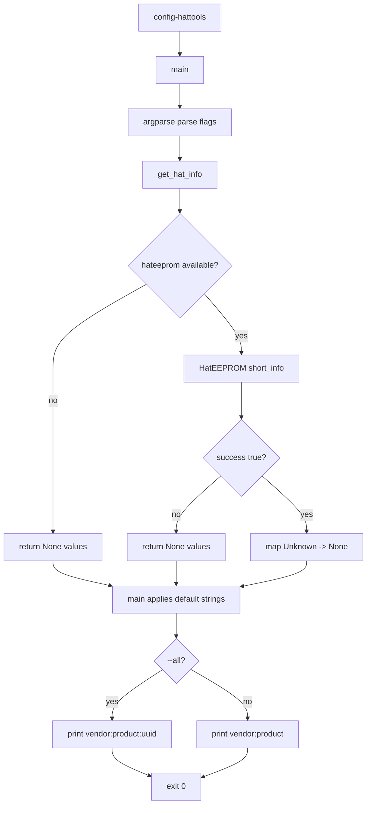

# hattools Command Flow

## Scope

This document describes the execution flow of [src/hattools.py](src/hattools.py), exposed by the `config-hattools` CLI command and reusable `get_hat_info()` helper.

## Entry Point

- Console script mapping in [setup.py](setup.py):
  - `config-hattools -> configurator.hattools:main`

Run examples:

- `config-hattools`
- `config-hattools --all`
- `config-hattools --verbose`
- `config-hattools -a -v`

## High-Level Flow

## Core Function Flow

### get_hat_info

Function: [src/hattools.py](src/hattools.py)

1. If `HatEEPROM` import is unavailable, returns `{"vendor": None, "product": None, "uuid": None}`.
2. Otherwise creates `HatEEPROM()` and calls `short_info(debug=False)`.
3. If `short_info` reports success:
   - extracts `vendor`, `product`, `uuid`
   - normalizes `'Unknown'` values to `None`
4. If read fails or an exception occurs, returns `None` values for all fields.

Verbose behavior:

- with `verbose=True`, warning/error logs are enabled for unavailable module and read exceptions.

### main

Function: [src/hattools.py](src/hattools.py)

1. Parses flags:
   - `-a/--all`: include UUID in output
   - `-v/--verbose`: raise logging level from ERROR to WARNING
2. Calls `get_hat_info(verbose=args.verbose)`.
3. Applies fallback output strings for missing values:
   - vendor: `no vendor`
   - product: `no product`
   - uuid: `unknown`
4. Prints one of:
   - `vendor:product` (default)
   - `vendor:product:uuid` (`--all`)
5. Returns exit code `0`.

## Output Contract

Default output:

- `vendor:product`

All-fields output:

- `vendor:product:uuid`

Even on read failures, output remains deterministic because defaults are applied in `main()`.

## Integration Points

Primary in-repo consumers of `get_hat_info()`:

- [src/systeminfo.py](src/systeminfo.py)
- [src/soundcard.py](src/soundcard.py)
- [src/soundcard_detector.py](src/soundcard_detector.py)

These modules use HAT vendor/product/UUID as inputs for system-reporting and card-detection heuristics.

## Side Effects

- Reads HAT EEPROM via `hateeprom` library when available.
- No subprocess/systemctl/DBus usage.
- No local file writes.

## Operational Notes

- The CLI is intentionally resilient: missing `hateeprom`, failed reads, or exceptions still produce stable output strings and success exit code.
- `--verbose` affects logging visibility only, not output format.
