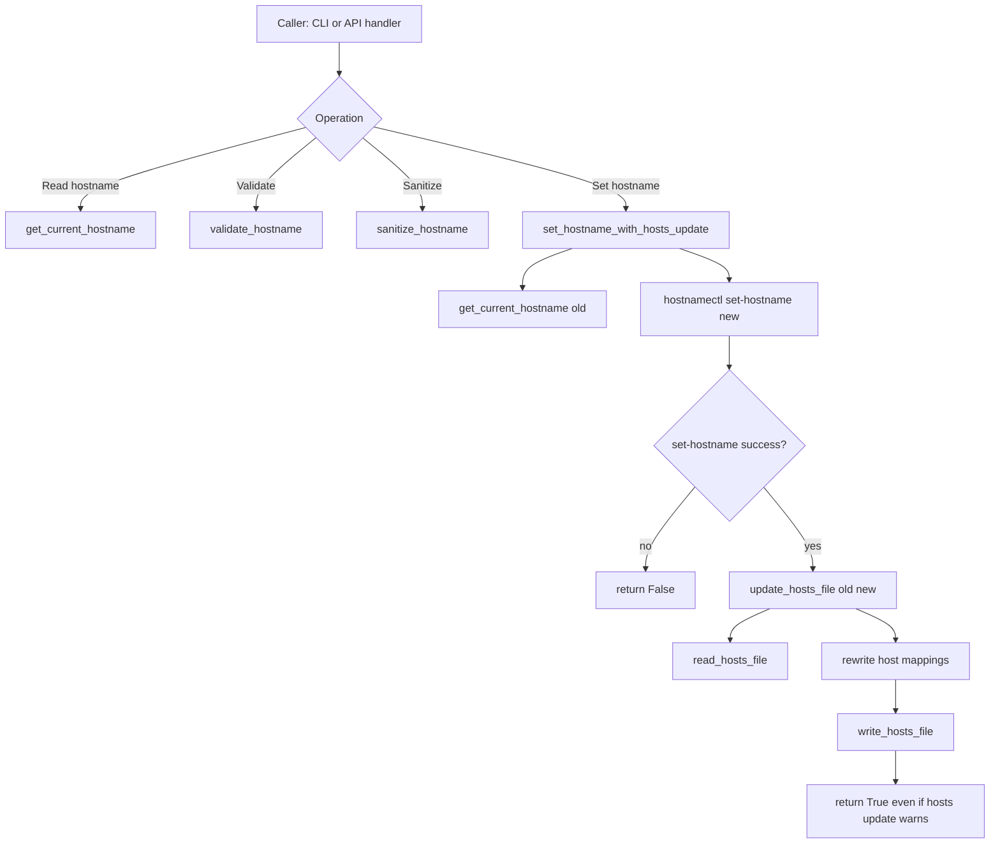

# hostconfig Flow

## Scope

This document describes the execution flow of [src/hostconfig.py](src/hostconfig.py), including its hostname update helpers and module-level CLI.

## Entry Points

- Module API functions used by other modules:
  - `set_hostname_with_hosts_update(new_hostname)`
  - `validate_hostname(hostname)`
  - `sanitize_hostname(pretty_hostname, max_length=64)`
- Module CLI in [src/hostconfig.py](src/hostconfig.py):
  - `main()` with subcommands `get`, `validate`, `sanitize`, `set`

Note:

- There is currently no dedicated `config-*` console script mapping for this module in [setup.py](setup.py).
- API hostname routes flow through [src/handlers/hostname_handler.py](src/handlers/hostname_handler.py), which imports `set_hostname_with_hosts_update` from this module.

## High-Level Flow

## Core Function Flows

### read_hosts_file

Function: [src/hostconfig.py](src/hostconfig.py)

1. Opens `/etc/hosts` as UTF-8.
2. Returns list of lines.
3. On error, logs and returns empty list.

### write_hosts_file

Function: [src/hostconfig.py](src/hostconfig.py)

1. Creates backup file `/etc/hosts.backup` from current content.
2. Writes updated host lines to `/etc/hosts`.
3. Returns `True` on success, `False` on error.

### update_hosts_file

Function: [src/hostconfig.py](src/hostconfig.py)

Inputs:

- `old_hostname`: hostname to remove (optional)
- `new_hostname`: hostname to ensure is mapped

Behavior:

1. Loads hosts lines (or default baseline lines if empty/unreadable).
2. Parses non-comment, non-empty lines into IP + hostnames.
3. Removes old hostname from matching entries when present.
4. Ensures `new_hostname` exists on `127.0.0.1` localhost entry.
5. Writes reconstructed lines via `write_hosts_file`.
6. Returns `False` only if critical write fails; otherwise returns `True` and may log warnings for non-critical cleanup failures.

### get_current_hostname

Function: [src/hostconfig.py](src/hostconfig.py)

1. Runs `hostnamectl hostname`.
2. Returns stripped hostname on success.
3. Returns `None` on command failure/exception.

### set_hostname_with_hosts_update

Function: [src/hostconfig.py](src/hostconfig.py)

1. Reads current hostname (`old_hostname`).
2. Executes `hostnamectl set-hostname <new_hostname>`.
3. If command fails: return `False`.
4. If command succeeds: attempts `update_hosts_file(old_hostname, new_hostname)`.
5. Returns `True` even when hosts-file update fails, because system hostname change is treated as the critical operation.

### validate_hostname

Function: [src/hostconfig.py](src/hostconfig.py)

Validation rules enforced:

- non-empty and max length 64
- characters restricted to ASCII letters, digits, hyphen, dot
- no leading/trailing hyphen or dot
- per-label checks after split by `.`:
  - label length 1..63
  - no leading/trailing hyphen

### sanitize_hostname

Function: [src/hostconfig.py](src/hostconfig.py)

Transformation steps:

1. Lowercase and replace spaces with hyphens.
2. Remove non `[a-z0-9-]` characters.
3. Collapse repeated hyphens and trim outer hyphens.
4. Truncate to `max_length` (default 64), then trim trailing hyphen.
5. Fallback to `hifiberry` if empty/invalid result.

### main (CLI)

Function: [src/hostconfig.py](src/hostconfig.py)

Subcommands:

- `get`
  - prints current hostname
  - exit `0` on success, `1` on failure
- `validate <hostname>`
  - prints valid/invalid message
  - exit `0` for valid, `1` for invalid
- `sanitize <hostname> [--max-length N]`
  - prints sanitized hostname
  - exit `0`
- `set <hostname>`
  - validates input then sets hostname via `set_hostname_with_hosts_update`
  - exit `0` on success, `1` on validation/set failure

## API Integration

Primary API path using this module:

- Route `/api/v1/hostname` in server routing -> [src/handlers/hostname_handler.py](src/handlers/hostname_handler.py)
- Handler calls:
  - validation/sanitization from [src/hostname_utils.py](src/hostname_utils.py)
  - hostname write operation via `set_hostname_with_hosts_update()` from [src/hostconfig.py](src/hostconfig.py)

## Side Effects

- Reads and writes `/etc/hosts` (including `/etc/hosts.backup` creation).
- Executes `hostnamectl` subprocess commands.
- No DBus usage in this module.

## Operational Notes

- Hostname setting is prioritized over hosts-file hygiene: a failed `/etc/hosts` update logs warning but does not roll back successful `hostnamectl set-hostname`.
- The module is designed to be resilient to malformed or partial `/etc/hosts` content by reconstructing valid lines where possible.
