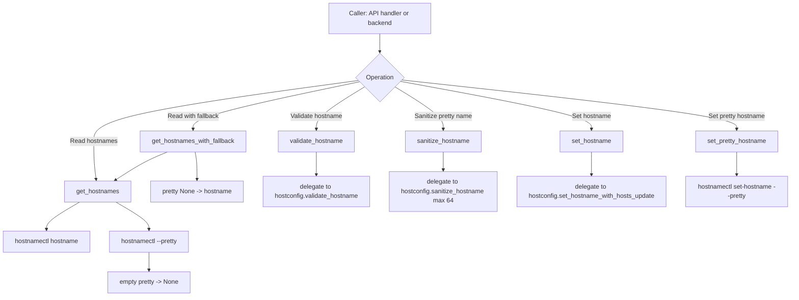

# hostname_utils Flow

## Scope

This document describes the execution flow of [src/hostname_utils.py](src/hostname_utils.py), which provides shared hostname helper functions for API handlers and backend modules.

## Entry Points

Primary consumers:

- [src/handlers/hostname_handler.py](src/handlers/hostname_handler.py)
- [src/systeminfo.py](src/systeminfo.py)

Key exported helpers:

- `get_hostnames()`
- `get_hostnames_with_fallback()`
- `validate_hostname()`
- `sanitize_hostname()`
- `validate_pretty_hostname()`
- `set_hostname()`
- `set_pretty_hostname()`

## High-Level Flow

## Function Flows

### get_hostnames

Function: [src/hostname_utils.py](src/hostname_utils.py)

1. Executes `hostnamectl hostname`.
2. Executes `hostnamectl --pretty`.
3. Converts an empty pretty hostname string to `None`.
4. Returns `(hostname, pretty_hostname)`.
5. On exception, returns `(None, None)`.

Behavior notes:

- Command failures are represented as `None` values, not exceptions.
- No retries are performed.

### get_hostnames_with_fallback

Function: [src/hostname_utils.py](src/hostname_utils.py)

1. Calls `get_hostnames()`.
2. If `pretty_hostname` is `None`, sets it to `hostname`.
3. Returns the tuple.

This gives callers a display-friendly pretty hostname even when no explicit pretty hostname is configured.

### validate_hostname

Function: [src/hostname_utils.py](src/hostname_utils.py)

- Delegates validation to `hostconfig.validate_hostname`.
- Keeps validation rules centralized in one backend implementation.

### sanitize_hostname

Function: [src/hostname_utils.py](src/hostname_utils.py)

- Delegates sanitization to `hostconfig.sanitize_hostname` with `max_length=64`.
- Ensures API and CLI layers share identical normalization behavior.

### validate_pretty_hostname

Function: [src/hostname_utils.py](src/hostname_utils.py)

Validation rules:

- non-empty
- length <= 64
- ASCII encodable
- printable characters only

Returns `True` only when all checks pass.

### set_hostname

Function: [src/hostname_utils.py](src/hostname_utils.py)

- Delegates to `hostconfig.set_hostname_with_hosts_update`.
- Side effects are inherited from hostconfig (hostnamectl + `/etc/hosts` reconciliation).

### set_pretty_hostname

Function: [src/hostname_utils.py](src/hostname_utils.py)

1. Executes `hostnamectl set-hostname --pretty <pretty_hostname>`.
2. Returns `True` on command success.
3. Returns `False` on non-zero exit or exception.

## API Integration

In [src/handlers/hostname_handler.py](src/handlers/hostname_handler.py):

- `handle_get_hostname()` uses `get_hostnames_with_fallback()`.
- `handle_set_hostname()` uses:
  - `validate_pretty_hostname()`
  - `sanitize_hostname()`
  - `validate_hostname()`
  - `set_pretty_hostname()`

This module acts as a normalization and orchestration layer between HTTP input handling and hostconfig system-side operations.

## Side Effects

- Executes `hostnamectl` commands via subprocess.
- Does not directly read/write `/etc/hosts`.
- No DBus usage.

## Operational Notes

- Validation and sanitization logic is intentionally shared with hostconfig to avoid drift between API and backend behavior.
- Fallback behavior (`pretty -> hostname`) prevents empty pretty hostname values in responses.
