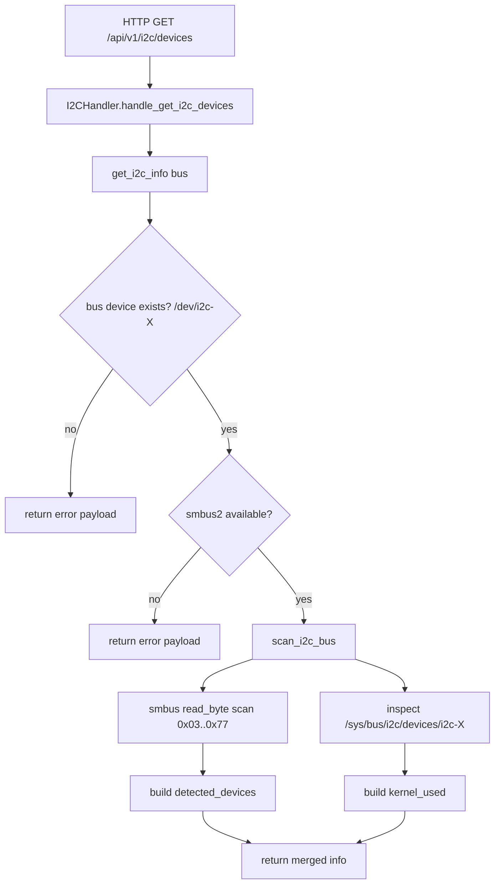

# i2c Module Flow

## Scope

This document describes the execution flow of [src/i2c.py](src/i2c.py), which provides I2C bus discovery helpers used by the API handler layer.

## Entry Points

Primary public functions:

- `get_i2c_info(bus_number=1)`
- `scan_i2c_bus(bus_number=1)`

Primary API integration:

- Route `/api/v1/i2c/devices` in [src/server.py](src/server.py)
- Handler [src/handlers/i2c_handler.py](src/handlers/i2c_handler.py) calls `get_i2c_info()`

Handler response semantics:

- HTTP 200 + `status: success` when backend payload has no `error`
- HTTP 200 + `status: error` when backend payload contains `error`
- HTTP 500 + `status: error` for unexpected handler/backend exceptions

## High-Level Flow

## Function Flows

### get_i2c_info

Function: [src/i2c.py](src/i2c.py)

1. Computes bus path `/dev/i2c-<bus_number>`.
2. Returns early with error if bus device path does not exist.
3. Returns early with error if `smbus2` is not importable.
4. Calls `scan_i2c_bus(bus_number)`.
5. Merges scan output into base response fields:
   - `bus_number`
   - `bus_path`
   - `bus_exists`
   - `smbus2_available`
   - optional `error`

### scan_i2c_bus

Function: [src/i2c.py](src/i2c.py)

1. Opens `smbus2.SMBus(bus_number)`.
2. Probes address range `0x03` to `0x77` via `read_byte`:
   - successful read -> add address to `detected_devices`
   - `OSError` -> treated as no responding device
3. Closes bus handle.
4. Best-effort reads `/sys/bus/i2c/devices/i2c-<bus_number>` to infer kernel-managed addresses (`kernel_used`).
5. Returns sorted result payload with:
   - `detected_devices`
   - `kernel_used`
   - `scan_range: 0x03-0x77`

Error behavior:

- Missing `smbus2` raises `ImportError` in `scan_i2c_bus`.
- Other scan failures are logged and re-raised.
- Caller `get_i2c_info` converts exceptions to payload `error` strings.

## Response Contract

Typical successful fields:

- `bus_number`
- `bus_path`
- `bus_exists`
- `smbus2_available`
- `detected_devices` (sorted list)
- `kernel_used` (sorted list)
- `scan_range`

Error shape:

- Includes `error` string while preserving base bus metadata fields.

## Side Effects

- Opens `/dev/i2c-<bus>` via `smbus2`.
- Probes hardware addresses on the selected bus.
- Reads sysfs path `/sys/bus/i2c/devices/i2c-<bus>` when available.
- No file writes, no DBus, no systemctl/subprocess use in this module.

## Operational Notes

- Scan is read/probe only, but still hardware-dependent and may be slow on problematic buses.
- Kernel-used and probed address lists can overlap and are intentionally reported separately.
