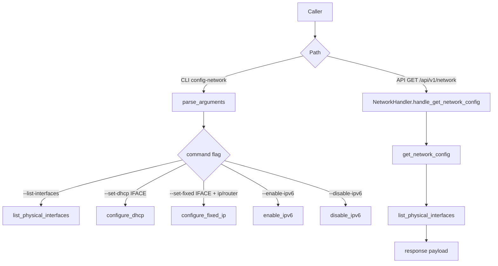

# network Command and API Flow

## Scope

This document describes the execution flow of [src/network.py](src/network.py), including both:

- CLI command entrypoint `config-network`
- API-backed read path `/api/v1/network`

## Entry Points

CLI entrypoint:

- `config-network` -> `configurator.network:main` in [setup.py](setup.py)

API entrypoint:

- Route `/api/v1/network` in [src/server.py](src/server.py)
- Handler [src/handlers/network_handler.py](src/handlers/network_handler.py) calls `get_network_config()`

Additional in-repo consumer:

- [src/ble_provisioning.py](src/ble_provisioning.py) calls `network.get_network_config()` to check runtime network state.

## High-Level Flow

## CLI Flow

Function: [src/network.py](src/network.py) `main()`

1. Parses one required command from a mutually exclusive group:
   - `--list-interfaces`
   - `--set-dhcp <interface>`
   - `--set-fixed <interface> --ip <addr/mask> --router <gateway>`
   - `--enable-ipv6`
   - `--disable-ipv6`
2. Configures logging with `setup_logging(verbose, quiet)`.
3. Executes command-specific path and exits with:
   - `0` on success
   - `1` on failed mutation/validation paths

Display options:

- `--long` changes list output to a single-line detailed format.
- `-v/--verbose` and `-q/--quiet` control stderr logging verbosity.

## Interface Discovery Flow

Functions: [src/network.py](src/network.py)

- `is_physical_interface(interface)`
- `list_physical_interfaces()`

Behavior summary:

1. Filters out known non-physical interfaces (loopback, Docker/bridge/veth, tun/tap/virtual patterns).
2. Detects likely physical interfaces using:
   - `/proc/net/wireless`
   - `/sys/class/net/<iface>/device`
   - optional `ethtool -i` driver detection
   - fallback naming heuristics (`eth*`, `en*`, `wlan*`, etc.)
3. Builds per-interface records with:
   - `name`, `mac`, `ipv4`, `netmask`, `state`, `type`

## NetworkManager Mutation Flows

Functions: [src/network.py](src/network.py)

- `configure_dhcp(interface)`
- `configure_fixed_ip(interface, ip_with_mask, router)`

Common behavior:

1. Confirms `NetworkManager` service is active (`systemctl is-active NetworkManager`).
2. Validates interface is physical via `is_physical_interface`.
3. Finds active connection bound to the target interface via `nmcli`.
4. Modifies existing connection or creates a new one.
5. Reactivates connection via `nmcli connection up`.

Static-IP specific validation:

- Requires IPv4 CIDR format for `--ip` (e.g. `192.168.1.10/24`).
- Requires dotted IPv4 format for `--router`.

## IPv6 System-Wide Flows

Functions: [src/network.py](src/network.py)

- `enable_ipv6()`
- `disable_ipv6()`

Enable flow:

1. Updates kernel cmdline via [src/cmdline.py](src/cmdline.py) `CmdlineTxt.enable_ipv6()`.
2. Removes disable sysctl file (`/etc/sysctl.d/99-disable-ipv6.conf`) when present.
3. Creates enable sysctl file (`/etc/sysctl.d/99-enable-ipv6.conf`).
4. Applies sysctl (`sysctl -p <file>`).
5. Sets `ipv6.method auto` on all NetworkManager connections.
6. Restarts `NetworkManager`.

Disable flow:

1. Creates disable sysctl file (`/etc/sysctl.d/99-disable-ipv6.conf`).
2. Removes enable sysctl file when present.
3. Applies sysctl (`sysctl -p <file>`).
4. Sets `ipv6.method disabled` on all NetworkManager connections.
5. Adds kernel disable token via `CmdlineTxt.disable_ipv6()` and saves cmdline.
6. Restarts `NetworkManager`.

Notes:

- Functions may return `False` with warnings if parts of the multi-step process fail.
- Kernel-level effects may require reboot for full behavior.

## API Read Flow

Handler: [src/handlers/network_handler.py](src/handlers/network_handler.py)

1. `handle_get_network_config()` calls `get_network_config()`.
2. `get_network_config()` collects:
   - hostname (`platform.node()`)
   - default gateway (`netifaces.gateways()`)
   - DNS servers (`/etc/resolv.conf`)
   - physical interfaces (`list_physical_interfaces()`)
3. Handler response:
   - HTTP 200 with `status: success` and `data` payload on success
   - HTTP 500 with `status: error` on exceptions

## Side Effects

Read-only operations:

- reads `/proc/net/wireless`, `/sys/class/net/*`, `/etc/resolv.conf`
- executes `nmcli`, `ethtool`, `systemctl` status checks

Mutation operations:

- modifies NetworkManager connection profiles (`nmcli connection modify/add/up`)
- writes/removes sysctl files under `/etc/sysctl.d/`
- applies sysctl settings (`sysctl -p`)
- updates kernel cmdline through [src/cmdline.py](src/cmdline.py)
- restarts `NetworkManager`

## Operational Notes

- Most mutation paths require elevated privileges.
- Interface detection intentionally favors practical Linux heuristics over strict hardware introspection.
- API endpoint is read-only; write operations are CLI-driven in this module.
