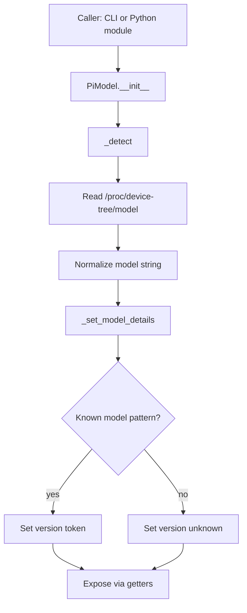

# pimodel Flow

## Scope

This document describes the execution flow of [src/configurator/pimodel.py](src/configurator/pimodel.py), which detects the Raspberry Pi model and maps it to a short version token.

## Entry Points

- Programmatic API:
  - `PiModel` class (`get_model_name`, `get_version`)
- CLI mode:
  - `main()` in [src/configurator/pimodel.py](src/configurator/pimodel.py)
  - generated command `config-detectpi` -> `configurator.pimodel:main`

The command is generated from `[project.scripts]` in [pyproject.toml](pyproject.toml).

## High-Level Flow

## Core Function Flow

### _normalize_model_name

Function: [src/configurator/pimodel.py](src/configurator/pimodel.py)

1. Trims surrounding whitespace.
2. Removes null bytes from device-tree text.

### PiModel._detect

Function: [src/configurator/pimodel.py](src/configurator/pimodel.py)

1. Reads `/proc/device-tree/model`.
2. Normalizes the model string.
3. Calls `_set_model_details` to classify version.
4. On `FileNotFoundError` or other `OSError`, keeps defaults:
  - `model_name = unknown`
  - `version = unknown`

### PiModel._set_model_details

Function: [src/configurator/pimodel.py](src/configurator/pimodel.py)

Maps model-name patterns to version tokens:

- Pi 3B+ -> `3B+`
- Pi 3A+ -> `3A+`
- Pi 3B -> `3B`
- Pi 4B -> `4`
- Compute Module 4 -> `CM4`
- Pi Zero W -> `0W`
- Pi Zero 2 W -> `0W2`
- Pi 2 -> `2`
- Pi 5 -> `5`
- Compute Module 5 -> `CM5`
- Unknown model -> `unknown`

### main (CLI)

Function: [src/configurator/pimodel.py](src/configurator/pimodel.py)

1. Suppresses log output for clean CLI output.
2. Instantiates `PiModel` (detection runs automatically).
3. Prints:
  - `Model: <model_name>`
  - `Version: <version>`

## Integration Points

Primary in-repo consumer:

- [src/configurator/systeminfo.py](src/configurator/systeminfo.py)

Observed usage pattern:

- `systeminfo` creates a `PiModel` instance and includes model/version values in system metadata payloads.

## Side Effects

- File I/O:
  - Reads `/proc/device-tree/model`
- Network I/O:
  - none
- Subprocess/systemctl/DBus:
  - none
