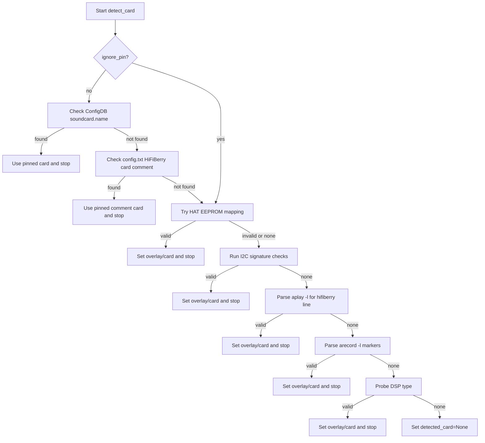

# Soundcard Detector Command Flow

This document describes how `config-detect` (`src/configurator/soundcard_detector.py`) detects and optionally stores HiFiBerry sound card configuration.

## Overview

`SoundcardDetector.detect_card()` runs a staged detection pipeline and stops on the first validated match.

Detection order:

1. Config database pin (`soundcard.name`)
2. `config.txt` pin comment (`# HiFiBerry card: ...`)
3. HAT EEPROM (`hattools.get_hat_info`)
4. I2C probing (`i2cget` checks)
5. ALSA playback scan (`aplay -l`)
6. ALSA capture scan (`arecord -l`, input-only cards)
7. DSP fallback (`detect_dsp`)

If all steps fail, detection returns `Unknown`.

## Detailed Flow

## Name Resolution Rules

- Overlay values are mapped to card names via `SOUND_CARD_DEFINITIONS`.
- HAT product names are preferred when available.
- Alias canonicalization normalizes detected names to canonical keys in `SOUND_CARD_DEFINITIONS`.
- DSP profile/checksum refinement may upgrade a generic card name to a more specific one.

## Storage and Configuration Flow

`detect_and_configure()` controls whether detection is only reported or written.

- `store=False`: print detected card name (or `Unknown`) and do not modify overlays.
- `store=True`: call `configure_card()`.

`configure_card()` behavior:

1. Abort if no overlay was detected.
2. Respect disabled auto-detection unless `--force` is set.
3. Replace existing HiFiBerry overlays with detected overlay.
4. Write/update `# HiFiBerry card: ...` comment before the overlay line.
5. Save config and create reboot marker file when configuration changed.
6. Optionally load overlay immediately (`--dtoverlay`).
7. Optionally reboot when configuration changed (`--reboot`).

## Important Operational Notes

- Detection command execution uses argument vectors (`subprocess.run`) rather than shell pipelines.
- I2C probe is detection-only and does not persist config changes by itself.
- `arecord` step is required for input-only cards that never appear in `aplay -l`.
- `ignore_pin=True` skips ConfigDB/comment pins and forces live hardware detection.

## CLI Flags

Key CLI options from `main()`:

- `--store`: write detected overlay/comment to config
- `--fallback-dac`: assume DAC+ Light if detection fails
- `--dtoverlay`: load overlay immediately after configuration
- `--reboot`: reboot on changed config
- `--force`: override disabled detection guard
- `-v`/`--verbose`: log per-step detection details
